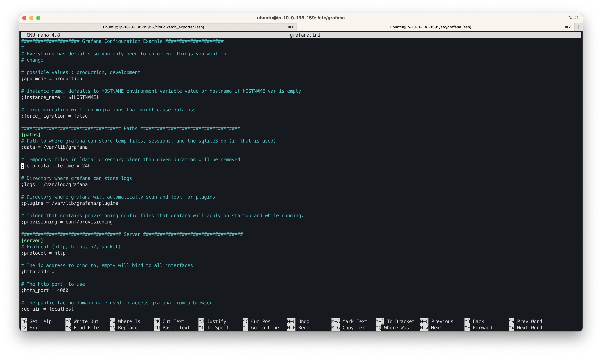
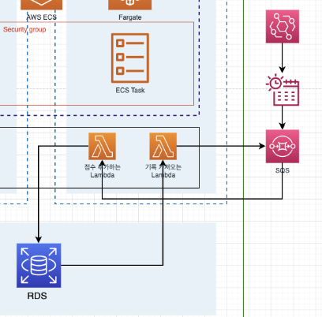
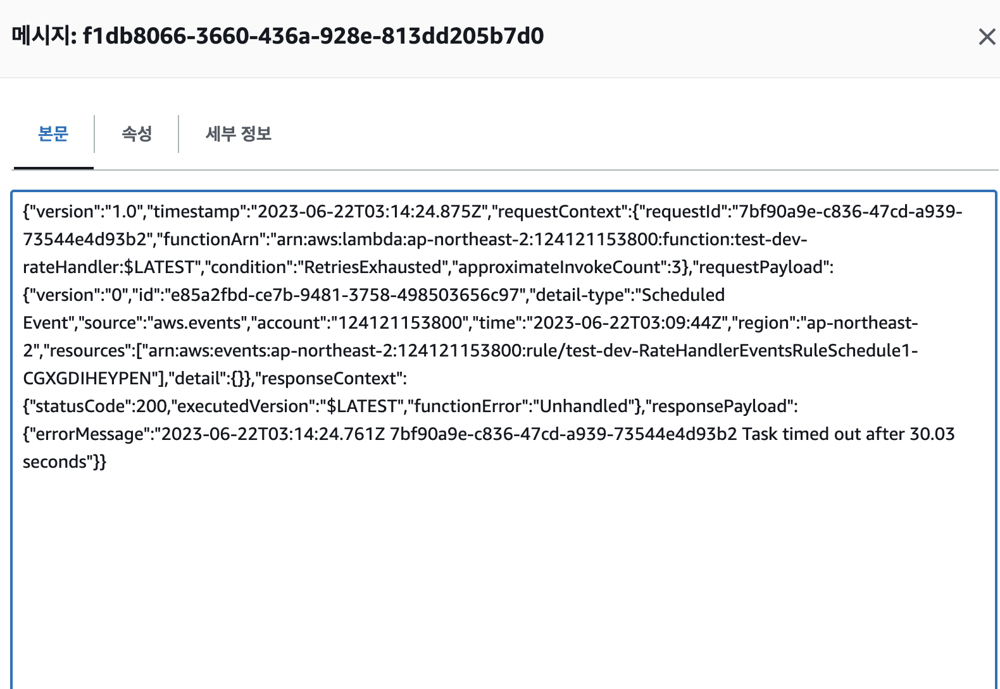

# 인증서의 상태가..?!

1. click 도메인을 사고 클라우드프론트 배포까지 하고 클린업할때 발급받은 인증서를 지웠다가 다시 클라우드 배포 할 일이 생겨서 다시 인증을 요청한 상태
2. __클린업을 하면서 vpc 호스팅 영역도 같이 지운상태__

---
**Amazon Route 53에서 퍼블릭 호스팅 영역에 대해 생성하는 NS 및 SOA 레코드**

Amazon Route 53는 생성하는 각 퍼블릭 호스팅 영역에 대해 NS(이름 서버) 레코드 및 SOA(권한 시작) 레코드를 자동으로 생성합니다. 이러한 레코드는 거의 변경할 필요가 없습니다.
https://docs.aws.amazon.com/ko_kr/Route53/latest/DeveloperGuide/SOA-NSrecords.html

## **NS(이름 서버) 레코드**

Amazon Route 53는 호스팅 영역과 이름이 동일한 NS(이름 서버) 레코드를 자동으로 생성하고, 호스팅 영역에 대한 신뢰할 수 있는 이름 서버 네 개를 나열합니다. 드문 경우를 제외하고 이 레코드에서 이름 서버를 추가, 변경 또는 삭제하지 않는 것이 좋습니다.

다음 예는 Route 53 이름 서버의 이름 형식을 보여줍니다(이것은 예시일 뿐이므로 등록자의 이름 서버 레코드를 업데이트할 때 사용하면 안 됩니다).

- *ns-2048.awsdns-64.com*
- *ns-2049.awsdns-65.net*
- *ns-2050.awsdns-66.org*
- *ns-2051.awsdns-67.co.uk*

vpc 지웠다 다시 생성했으므로 전에 만들었던 ns 주소가 달라졌기에 검증이 무한 대기중이라 생각
](image-3.png)
<주소 똑같이 바꿔줌>

<검증 대기>

aws 호스팅 영역을 지웠다가 다시 생성했던 사람은 ns의 값이 바뀐다
바뀐 ns 값을 edit 해주면 acm 검증이 바로 될줄알았는데... 안돼서 도메인 하나 샀다;;