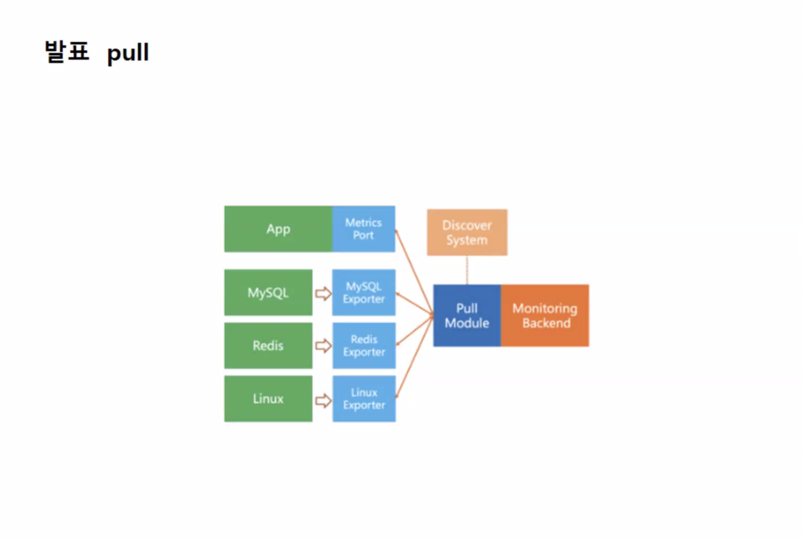

서비스 디스커버리

|  | pull | push |
| --- | --- | --- |
| 장점 | 중앙 집중식 구성
서비스 검색
로드 관리 | 대기 시간 단축
네트워크 경계 통과 용이 |
| 단점 | 네트워크 접근성
대기 시간 증가 | 분산형 구성
서비스 검색
로드 관리 |
| 모니터링 도구 | 프로메테우스
influxdb | aws cloudwatch
graphite |

latency

sre

site reliability engineering

시스템 안정성을 보장하기 위한 사고 방식

직무 역일

메트릭

규범적 방범

sre 의 주요 원칙

error budgets 가용성의 양 오류가 발생했을때 오류 예산을 줄이기 위해

scls (service level indicator) 대기시간

slos(service level objective) sli의 지표값 slo는 비즈니스, 개발자 및 운영자가 합의한 일정한 기간 동안의 SLI 목표값

slas(service level agreement) 100 - slo 값

99.99, 99.95가 좋은거임

cpu 사용량 50도 안넘기게 실무에선

mttd 장애 인지 시간

mtti 장애 식별

mttr 장애 복구 시간

kibana 

open search

마이크로서비스 모니터링

 

