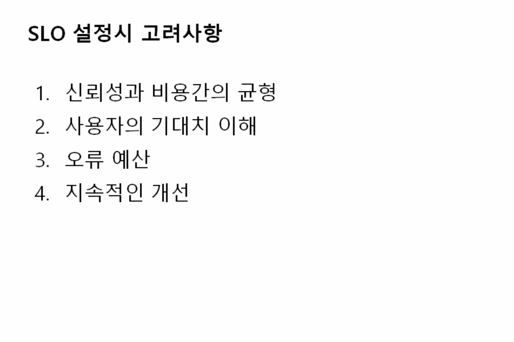

# ✅ 시각화된 모니터링 시스템이 구축
시스템 메트릭 또는 저장된 데이터에 대한 하나 이상의 시각화된 모니터링 시스템이 구축되어야합니다.

---

우리 아키텍처에서 병목구간이 생기는 지점 대회신청 구간이라고 생각 
- esc 백엔드 api 매트릭을 수집하기 위해서 ecs-exporter, cloudwatch-exporter,프로메테우스, 그라파나

---
private ec2에 설치

---
## 🤔private ec2에 실행중인 그라파나 포트 4000 http://localhost:4000으로 연결후 접속되는걸 확인 로컬에서 실행하려면 어떻게 하는지 모르겠음

참고한 레퍼런스 https://rohan-j-tiwari.medium.com/grafana-installation-on-amazon-private-ec2-instance-36dda72299d2

프라이빗 서브넷에 있는 ec2에 연결해야 함으로 로드 밸런서를 만들어 줘야된다고 해서 따라 했는데 실페

---

재환님이 로컬에서 cloudwatch insight를 통해서 그라파나로 시각화 할 수 있다고 했음 
