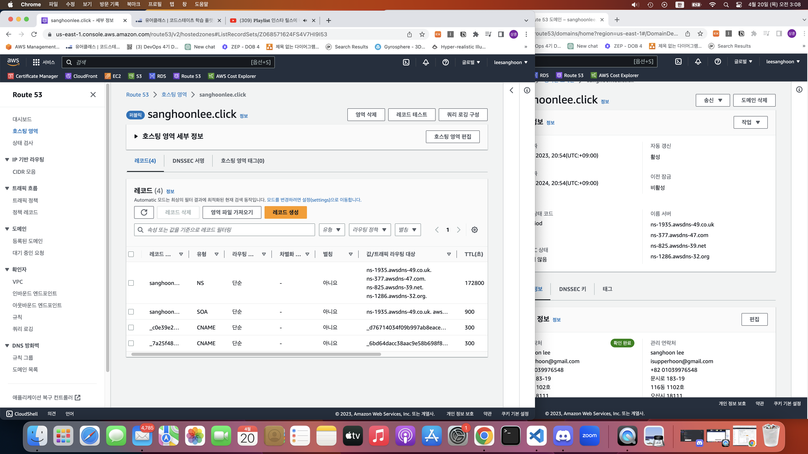
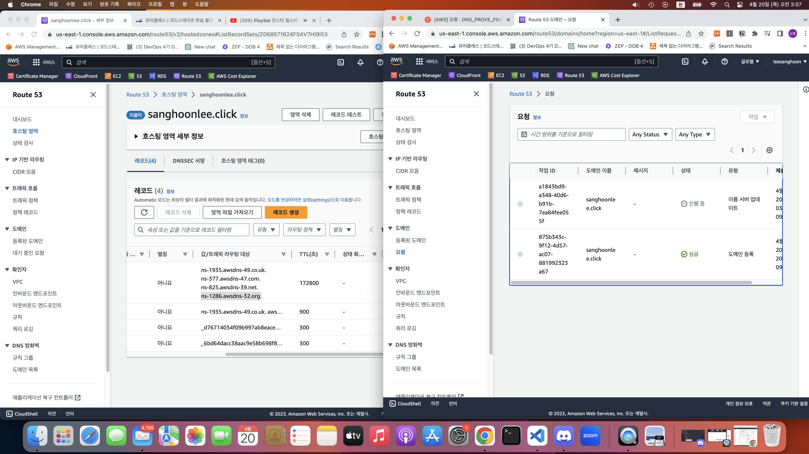

# ✅ 서버리스 프레임워크로 람다 만들기

serverless sqs worker 템플릿을 사용후 기록가져오는 람다 함수 작성

---

sqs에 보내는 메세지를 실패해서 에러가 자꾸 뜸...
sendMessage 부분에서 타임아웃
 

거의 모든 시간을 람다와 보냈지만 해결 하지 못했는데 재환님이 해결하셨다... 자세한건 재환님 블로그를 봐야겠다..