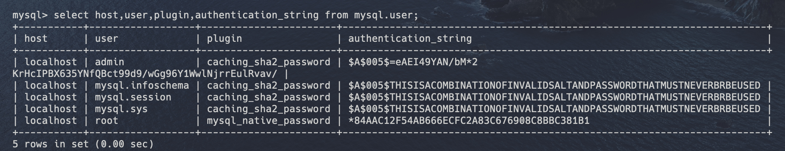

### ER_NOT_SUPPORTED_AUTH_MODE

##### 'Client does not support authentication protocol requested by server; consider upgrading MySQL client',

mysql의 default_authentication_plugin은 mysql_native_password였다
하지만 mysql 8 부터 보안이 강화된 caching_sha2_password로 변경되면서  
mysql 모듈이cha2 방식을 지원하지 못해 node.js에서 db 연동이 안되었다.

###

1. caching_sha2_password 방식을 지원하는 mysql2 모듈을 사용한다

2. default_authentication_plugin(기본 인증 플러그인)을 mysql_native_password으로 다운그레이드 한다.

플러그인을 바꿔 준다

