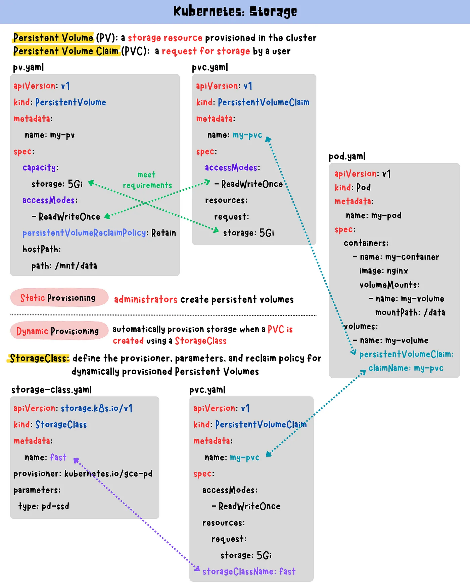

nfs  
nfs 볼륨을 사용하면 기존 NFS(네트워크 파일 시스템) 공유를 포드에 마운트할 수 있습니다. Pod가 제거될 때 지워지는 emptyDir과 달리 nfs 볼륨의 콘텐츠는 보존되고 볼륨은 마운트 해제만 됩니다. 이는 NFS 볼륨이 데이터로 미리 채워질 수 있고 해당 데이터가 포드 간에 공유될 수 있음을 의미합니다. NFS는 여러 작성자가 동시에 마운트할 수 있습니다.

nfs usage

```yml
apiVersion: v1
kind: Pod
metadata:
  name: test-pd
spec:
  containers:
    - image: registry.k8s.io/test-webserver
      name: test-container
      volumeMounts:
        - mountPath: /my-nfs-data
          name: test-volume
  volumes:
    - name: test-volume
      nfs:
        server: my-nfs-server.example.com
        path: /my-nfs-volume
        readOnly: true
```

> 메모:
> 공유를 사용하려면 먼저 내보낸 공유로 실행 중인 자체 NFS 서버가 있어야 합니다.
> 또한 Pod 사양에서는 NFS 마운트 옵션을 지정할 수 없습니다. 서버측 마운트 옵션을 설정하거나 /etc/nfsmount.conf를 사용할 수 있습니다. 마운트 옵션을 설정할 수 있는 PertantVolume을 통해 NFS 볼륨을 마운트할 수도 있습니다.

예를 들어 NFS는 내부 프로비저너를 제공하지 않지만 외부 프로비저너를 사용할 수 있습니다. 타사 스토리지 공급업체가 자체 외부 프로비저너를 제공하는 경우도 있습니다.

# kubernetes 클러스터에 nfs 서버 설정

클러스터에 nfs csi 드라이버가 배포된 후 이 설명서에 따라 몇가지 예제 애플리케이션을 빠르게 배포 할 수있습니다. NFS CSI 드라이버를 사용하여 정적 또는 동적으로 영구 볼륨을 프로비저닝할 수 있습니다. 정적 및 동적 프로비저닝에 대한 자세한 내용은 Kubernetes 영구 볼륨을 참조하세요.

플러그인을 테스트하는 데 사용할 수 있는 여러 가지 NFS 서버가 있으며, 프로토콜 v2, v3 및 v4의 주요 버전은 현재 구현에서 지원되어야 합니다. 이 페이지에서는 Kubernetes 클러스터에 NFS 서버 배포를 설정하는 방법을 보여줍니다.

- (linux/amd64의 경우) Kubernetes 클러스터에 NFS 프로비저너를 생성하려면 다음 명령을 실행하세요.

```bash
kubectl create -f https://raw.githubusercontent.com/kubernetes-csi/csi-driver-nfs/master/deploy/example/nfs-provisioner/nfs-server.yaml
```

- (linux/arm의 경우) Kubernetes 클러스터에 NFS 프로비저너를 생성하려면 다음 명령을 실행합니다.

```bash
git clone https://github.com/sjiveson/nfs-server-alpine.git
cd nfs-server-alpine
docker built -t <your-name>/nfs-server-alpine:latest-arm .
wget https://raw.githubusercontent.com/kubernetes-csi/csi-driver-nfs/master/deploy/example/nfs-provisioner/nfs-server.yaml
sed -i 's/<your-name>/itsthenetwork/' nfs-server.yaml
kubectl create -f nfs-server.yaml
```

- NFS 서버 엔드포인트 nfs-server.default.svc.cluster.local 및 공유 경로 /를 노출하는 새로운 서비스 nfs-server가 생성됩니다. 이러한 정보를 사용하여 PertantVolume 또는 StorageClass를 지정할 수 있습니다.

- NFS CSI 드라이버를 배포합니다. [NFS CSI 드라이버 설치](https://github.com/kubernetes-csi/csi-driver-nfs/blob/master/docs/install-nfs-csi-driver.md)를 참조하세요.

- NFS 서버가 작동하는지 확인하기 위해 PertantVolume 및 PertantVolumeClaim을 정적으로 생성하고 이를 샘플 Pod에 마운트할 수 있습니다.

```bash
kubectl create -f https://raw.githubusercontent.com/kubernetes-csi/csi-driver-nfs/master/deploy/example/nfs-provisioner/nginx-pod.yaml
```

- NFS 서버가 작동하는지 확인하고 예제 포드에서 마운트 지점을 확인할 수 있습니다.

```bash
kubectl exec nginx-nfs-example -- bash -c "findmnt /var/www -o TARGET,SOURCE,FSTYPE"
```

- 출력은 다음과 같아야 합니다.

```bash
TARGET   SOURCE                                 FSTYPE
/var/www nfs-server.default.svc.cluster.local:/ nfs4
```

---

# CSI driver 예제

You can use NFS CSI Driver to provision Persistent Volumes statically or dynamically. [Kubernetes Persistent Volumes documentation](https://kubernetes.io/docs/concepts/storage/persistent-volumes/) Static and Dynamic provisioning 에대한 더 많은 정보.

Please refer to [driver parameters](../../docs/driver-parameters.md) for more detailed usage.

## Prerequisite

- [Set up a NFS Server on a Kubernetes cluster](./nfs-provisioner/README.md) as an example
- [Install NFS CSI Driver](../../docs/install-nfs-csi-driver.md)

## Storage Class Usage (Dynamic Provisioning)

- Create a storage class
  > change `server`, `share` with your existing NFS server address and share name

```yaml
apiVersion: storage.k8s.io/v1
kind: StorageClass
metadata:
  name: nfs-csi
provisioner: nfs.csi.k8s.io
parameters:
  server: nfs-server.default.svc.cluster.local
  share: /
  # csi.storage.k8s.io/provisioner-secret is only needed for providing mountOptions in DeleteVolume
  # csi.storage.k8s.io/provisioner-secret-name: "mount-options"
  # csi.storage.k8s.io/provisioner-secret-namespace: "default"
reclaimPolicy: Delete
volumeBindingMode: Immediate
mountOptions:
  - nfsvers=4.1
```

- create PVC

```console
kubectl create -f https://raw.githubusercontent.com/kubernetes-csi/csi-driver-nfs/master/deploy/example/pvc-nfs-csi-dynamic.yaml
```

## PV/PVC Usage (Static Provisioning)

- Follow the following command to create `PersistentVolume` and `PersistentVolumeClaim` statically.

```bash
# create PV
kubectl create -f https://raw.githubusercontent.com/kubernetes-csi/csi-driver-nfs/master/deploy/example/pv-nfs-csi.yaml

# create PVC
kubectl create -f https://raw.githubusercontent.com/kubernetes-csi/csi-driver-nfs/master/deploy/example/pvc-nfs-csi-static.yaml
```

## Create a deployment

```console
kubectl create -f https://raw.githubusercontent.com/kubernetes-csi/csi-driver-nfs/master/deploy/example/deployment.yaml
```

스토리지 클래스를 사용하는 pvc와 pvc를 이용한 파드를 생성
pvc 리소스를 먼저 만들고 해당 Pvc를 파드에서 마운트하는 형식입니다

정리하면 PVC 매니페스트에 스토리지클래스를 지정하고 PVC를 생성하면 스토리지클래스가 자동으로 PV를 생성합니다. PV를 먼저 생성할 필요없이 매니페스트로 PVC를 생성하면 동적으로 PV를 생성합니다.

```console
helm repo add csi-driver-nfs https://raw.githubusercontent.com/kubernetes-csi/csi-driver-nfs/master/charts
helm install csi-driver-nfs csi-driver-nfs/csi-driver-nfs --namespace kube-system --version v4.8.0
```

---

```yaml
kind: Service
apiVersion: v1
metadata:
  name: nfs-server
  namespace: default
  labels:
    app: nfs-server
spec:
  type: ClusterIP # use "LoadBalancer" to get a public ip
  selector:
    app: nfs-server
  ports:
    - name: tcp-2049
      port: 2049
      protocol: TCP
    - name: udp-111
      port: 111
      protocol: UDP
---
kind: Deployment
apiVersion: apps/v1
metadata:
  name: nfs-server
  namespace: default
spec:
  replicas: 1
  selector:
    matchLabels:
      app: nfs-server
  template:
    metadata:
      name: nfs-server
      labels:
        app: nfs-server
    spec:
      nodeSelector:
        "kubernetes.io/os": linux
      containers:
        - name: nfs-server
          image: itsthenetwork/nfs-server-alpine:latest
          env:
            - name: SHARED_DIRECTORY
              value: "/exports"
          volumeMounts:
            - mountPath: /exports
              name: nfs-vol
          securityContext:
            privileged: true
          ports:
            - name: tcp-2049
              containerPort: 2049
              protocol: TCP
            - name: udp-111
              containerPort: 111
              protocol: UDP
      volumes:
        - name: nfs-vol
          hostPath:
            path: /nfs-vol # modify this to specify another path to store nfs share data
            type: DirectoryOrCreate

---
apiVersion: storage.k8s.io/v1
kind: StorageClass
metadata:
  name: nfs-csi
provisioner: nfs.csi.k8s.io
parameters:
  server: nfs-server.default.svc.cluster.local
  share: /
  # csi.storage.k8s.io/provisioner-secret is only needed for providing mountOptions in DeleteVolume
  # csi.storage.k8s.io/provisioner-secret-name: "mount-options"
  # csi.storage.k8s.io/provisioner-secret-namespace: "default"
reclaimPolicy: Delete
volumeBindingMode: Immediate
mountOptions:
  - nfsvers=4.1
---
apiVersion: v1
kind: PersistentVolumeClaim
metadata:
  name: pvc-nfs-dynamic
  namespace: default
spec:
  accessModes:
    - ReadWriteMany
  resources:
    requests:
      storage: 10Gi
  storageClassName: nfs-csi
---
cat pod.yml
apiVersion: apps/v1
kind: Deployment
metadata:
  name: nginx
spec:
  replicas: 2
  selector:  # selector는 여전히 여기에 위치해야 함
    matchLabels:
      app: nginx
  template:
    metadata:
      labels:  # 'lables' 오타 수정
        app: nginx
    spec:
      containers:
      - name: nginx
        image: nginx
        ports:
        - containerPort: 80
        volumeMounts:
        - mountPath: /usr/share/nginx/html
          name: nfs
      volumes:
        - name: nfs
          persistentVolumeClaim:
            claimName: pvc-nfs-dynamic


```

nginx 파드에 들어가서
Echo "<h1>nfs-server</h1>" | tee /usr/share/nginx/html/index.html
만들어주고 파드 삭제후 다시 만들어진 파드에
curl localhost 하면 잘된다
Nfs-server에 들어가서 /Exports에 들어가면 pvc-eb887cf3-3910-4475-b704-702553fa6561 라는 새로운 폴더에 Index.html 이저장되어있는걸 확인할수있다

> https://yuminlee2.medium.com/kubernetes-storage-fe5363d88d42

> https://kubernetes.io/docs/concepts/storage/volumes/

> https://github.com/kubernetes-csi/csi-driver-nfs/blob/master/deploy/example/README.md
