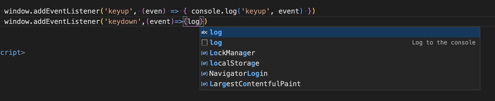
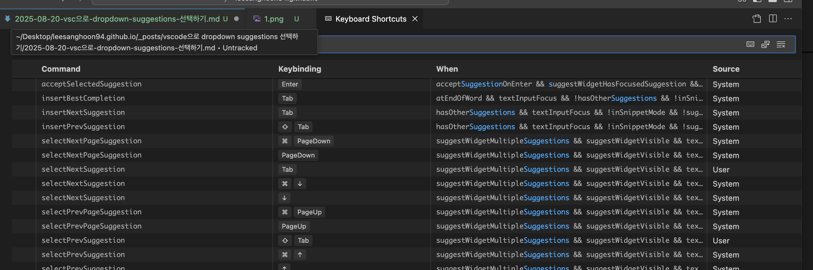

vscode editor suggestions dropdown  

제안해주는건 고맙지만 방향키 위아래로 선택하는방식이 상당히 불편하다.  
단축키설정에서 tap 키로 선택할수있도록 바꿔준다.
## json 파일 수정
```
keybindings.json에서:
json[
  {
    "key": "tab",
    "command": "selectNextSuggestion",
    "when": "suggestWidgetVisible"
  },
  {
    "key": "shift+tab",
    "command": "selectPrevSuggestion", 
    "when": "suggestWidgetVisible"
  },
  {
    "key": "enter",
    "command": "acceptSelectedSuggestion",
    "when": "suggestWidgetVisible"
  }
]
```

## 단축키 gui 수정 (⌘k ⌘s)


selectNextSuggestion tap  
selectPrevSuggestion shift + tap


수정해준다.

