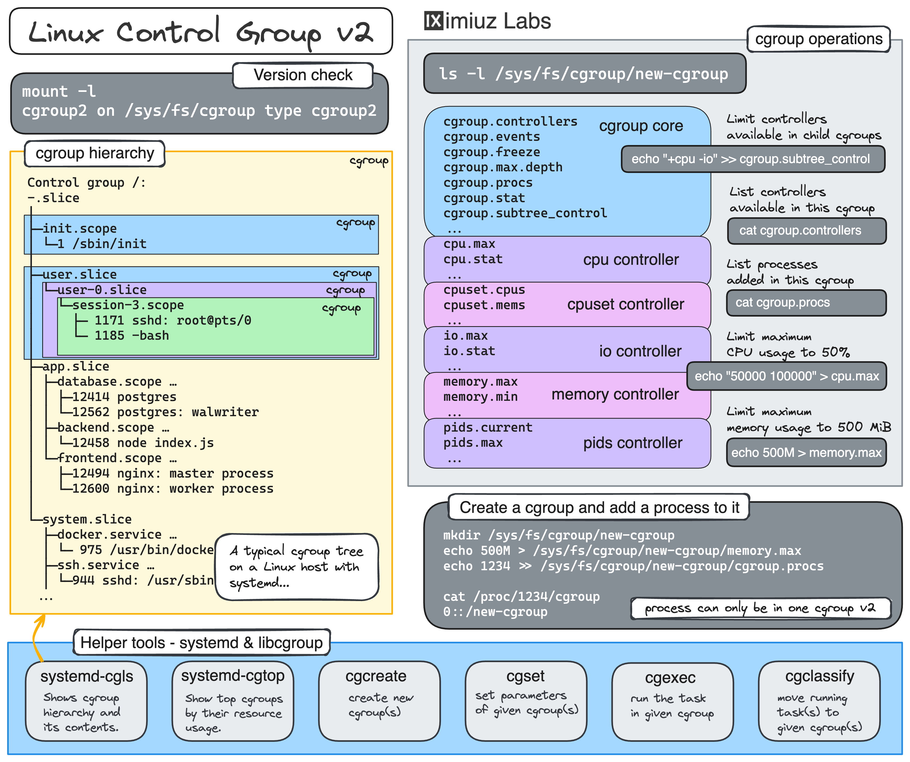

Linux 제어 그룹을 사용하여 프로세스 리소스 제어.

포괄적인 가이드는 아니지만 Linux cgroup을 사용하여 프로세스의 CPU 및 RAM 소비를 제한하는 방법에 대한 실제 예입니다. 이 기술은 다음과 같은 용도로 사용될 수 있습니다.
특히 리소스를 많이 사용하는 프로세스로부터 시스템을 보호합니다.
여러 애플리케이션 간에 공정한 리소스 분배 보장
제한된 리소스에서 애플리케이션 성능 테스트
멀티 테넌트 환경에서 리소스 가용성 보장
가장 기본적인(그리고 노동 집약적인) 방법, 즉 가상 파일 시스템 cgroupfs를 조작하여 cgroup에 프로세스를 생성, 구성 및 추가하는 것부터 시작하겠습니다. 그런 다음 libcgroup의 cgcreate 및 cgexec 또는 systemd의 systemd-run 및 슬라이스 장치와 같은 상위 수준 도구를 사용하여 정확히 동일한 작업을 수행할 수 있는 방법을 살펴보겠습니다.
프로세스 리소스를 제어하는 ​​Linux 기반 방법에 중점을 두지만, 다루는 기술은 컨테이너 및 Pod의 리소스 관리에도 직접 적용할 수 있으므로 이 튜토리얼은 Docker 및 Pod를 실행하는 사람들에게도 관련성이 높습니다. 쿠버네티스.

이 게시물의 예는 cgroup v2를 활용하지만 일반적인 아이디어는 cgroup v1에서도 작동해야 합니다.

> Control groups, usually referred to as cgroups, are a Linux
> kernel feature which allow processes to be organized into
> hierarchical groups whose usage of various types of resources can
> then be limited and monitored.

cgroup은 가짜 파일 시스템 폴더 및 파일을 통해 관리되므로 특정 폴더(또는 해당 파일)에 대한 쓰기 액세스 권한을 부여하면 루트가 아닌 사용자가 하위 cgroup 생성을 포함하여 cgroup을 구성할 수 있습니다. 하위 cgroup에 사용 가능한 컨트롤러 세트를 추가로 제한해야 하는 경우 상위 cgroup.subtree_control 파일에 작성하여 수행할 수 있습니다.

Configuring a cgroup using cgroupfs
First, let's create a new cgroup by making a directory in the cgroup filesystem. This will be the group where we can set limits on CPU and memory usage for our resource-hungry process.
mkdir /sys/fs/cgroup/hog_pen
Copy to clipboard
Next, we'll set limits on CPU and memory usage. Let's say we want to limit the CPU usage to 50% and the memory usage to 100MB.
To limit CPU usage, we'll write the <cpu_quota> and <cpu_period> values to the cpu.max file:
echo "50000 100000" > /sys/fs/cgroup/hog_pen/cpu.max
Copy to clipboard
Here, 50000 is the maximum allowed CPU time per period (in microseconds), and 100000 is the period duration. This effectively limits the CPU usage to 50%.

PID를 cgroup.procs에 기록하여 이미 실행 중인 프로세스를 cgroup에 추가하는 것은 편리하지만, 프로세스 사이에 짧은 간격도 남기지 않고 프로세스의 리소스 소비를 항상 제한하려는 경우에는 작동하지 않습니다. 프로세스가 시작되고 cgroup에 추가됩니다.
다행히 프로세스가 시작되면 상위 프로세스의 cgroup을 상속하므로 상위 프로세스를 필수 cgroup으로 이동한 다음 이미 제한된 하위 프로세스를 시작하도록 할 수 있습니다.

---

create_bridge bridge1 br1
create_end_host host1 eth1 bridge1 br1
create_end_host host2 eth2 bridge1 br1
create_end_host host3 eth3 bridge1 br1

Inspect the traffic captured by the tcpdump processes. Notice how Ethernet frames (in particular, ARP requests) that belong to one subnet are actually visible to the hosts from another subnet.
First of all, the above example proves that it's indeed possible to have multiple IP subnets over a shared L2 segment. However, it also shows that there is a lack of isolation and the traffic destined to one of the subnets is visible to the nodes from another subnet. It happens because nodes from both subnets share the same L2 broadcast domain. This may be undesirable, in particular, due to security concerns (see ARP spoofing). In such a situation, configuring multiple VLANs on the shared bridge can bring the proper isolation.

---

새로운 유저 추가 kubernetes의 Rbac을 통해 권한을

Kubernetes의 역할 기반 액세스는 Kubernetes API 리소스에 대해 사용자 또는 서비스 계정이 수행하는 작업을 허용하는 데 사용됩니다. RBAC에는 "거부" 규칙이 없으므로 해당 사용자 또는 서비스 계정에 꼭 필요한 작업을 설정하도록 주의해야 합니다.

지정된 네임스페이스의 Kubernetes 리소스에 대한 액세스(예: 가져오기, 나열, 삭제 등)를 할당하기 위해 Kubernetes에서 역할이 생성됩니다.

RoleBinding은 서비스 계정이나 사용자에게 해당 리소스의 권한을 할당하기 위해 네임스페이스 내에 생성되고 역할에 연결됩니다.

Create a certificate signing request
Since Kubernetes doesn't have a "user" resource, all that's required is a client certificate and key with the common name (CN) to match the user's name.

In our case, when we created the RoleBinding, we assigned it to the user "carlton", so that user will assume the permissions from the Role for that resource.

As long as the CN in the key is "carlton", we will be able to use this to access the Kubernetes API.

To create a private key, we can use the openssl command-line tool. We'll use 2048 bit encryption and we'll name it carlton.key

openssl genrsa -out carlton.key 2048

Kubernetes itself is a certificate authority, therefore, it can approve and generate certificates. How convenient!

Let's create a Certificate Signing Request (CSR) for the Kubernetes API using our private key and insert the common name and output that to a file named carlton.csr with the following command

openssl req -new -key carlton.key -subj "/CN=carlton" -out carlton.csr

🛑IMPORTANT🛑: Make sure to insert the Common Name (CN) into your CSR, or else the certificate will become invalid
Listing the contents of your current directory should look like this:

Submit CSR to Kubernetes API
Now that we have a CSR, we can submit it to the Kubernetes API for approval.

First, let's store the value of the CSR in an environment variable named "REQUEST"

export REQUEST=$(cat carlton.csr | base64 -w 0)

Then, we can create a YAML manifest and sumbit it to the Kubernetes API. Insert the $REQUEST variable next to "request: " like so

cat <<EOF | kubectl apply -f -
apiVersion: certificates.k8s.io/v1
kind: CertificateSigningRequest
metadata:
name: carlton
spec:
groups:

- system:authenticated
  request: $REQUEST
  signerName: kubernetes.io/kube-apiserver-client
  usages:
- client auth
  EOF
  The output of the command k get csr should result in the following:

$ k get csr

Let's assume the role that we set for our new user and test access to Kubernetes!

In order to get our client certificate that we can use in our kubeconfig, we'll approve the CSR we submitted to the Kubernetes API

k certificate approve carlton

The output of the command k get csr should now have the condition "Approved,Issued":

$ k get csr
NAME AGE SIGNERNAME REQUESTOR REQUESTEDDURATION CONDITION
csr-hs6d2 16d kubernetes.io/kube-apiserver-client-kubelet system:node:controlplane <none> Approved,Issued
carlton 6m48s kubernetes.io/kube-apiserver-client kubernetes-admin <none> Approved,Issued
We can extract the client certificate out from the "k get csr" command, decode it and save it to a file named carlton.crt

k get csr carlton -o jsonpath='{.status.certificate}' | base64 -d > carlton.crt

Now that we have the key and certificate, we can set the credentials in our kubeconfig and embed the certs within

k config set-credentials carlton --client-key=carlton.key --client-certificate=carlton.crt --embed-certs

🔥TIP🔥: You can remove the --embed-certs and they will remain pointers to the key and certificate files. Try it out!
The output of k config view will now show carlton as one of the users

Next, we'll set and use the context in which kubectl uses to access the Kubernetes API

k config set-context carlton --user=carlton --cluster=kubernetes

k config use-context carlton

Finally, we can test if our carlton user can get pods in the web namespace

k -n web get po
