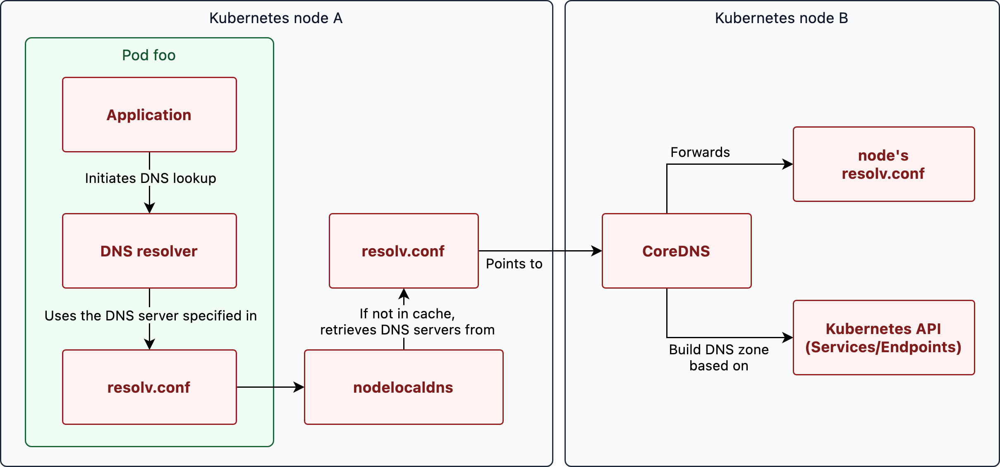

당신의 pod에서 nslookup이 실패하는 이유
들어가기 전에
쿠버네티스에서 여러 노드의 서비스에 접근하기 위해 coreDNS에 DNS 쿼리를 날려 레코드 조회를 할 수 있습니다.
dns 이름에는 규칙이 존재하는데, 다음과 같은 A/AAAA 레코드를 따릅니다.
예를 들어 new 라는 네임스페이스에 속한 nginx가 있다고 했을 때 이 서비스에 접근하는 도메인은 nginx.new.svc.cluster.local 입니다. 서비스와 네임스페이스를 연결한 다음에 마지막에 svc.cluster.local을 붙이면 됩니다.
하지만 다음과 같은 Shot-form 형식의 도메인으로 도 서비스에 접근할 수 있습니다.
app.namespace
app.namespace.svc

pod에서 dns 조회하기 위해서 dns 쿼리하기위해 어떤 과정을 거치는지
브라우저에서 dns쿼리를 조회하는것처럼 파드에서도 로컬 dns 설정을 먼저 확인합니다
etc/resolve.conf 설정

기본적으로 kubelet에서 제공하는 /etc/resolve.conf 파일은 모든 Dns 쿼리를 클러스터의 dns 서버로 전달합니다. Kubelet은 또 search domain과 ndots Dns 쿼리 옵션을 정의합니다.

search domain은 short dns가 제공될때 추가해서 검색해야 하는 도메인 접미사를 지정합니다
ndots 옵션은 먼저 search domain을 추가할지, absolute domain에 대한 쿼리를 바로 수행할지를 결정합니다
absoulte domain이란 사용자가 질의한 원래의 도메인 이름을 말합니다.
예를 들어 shor dns로 조회를 수행한다고 가정할떼, ndots옵션이 5로 설정되어있으면 Resolver는 도메인 점 수를 계산한다
점이 5개 미안이면 Dns 서버에서 Dns조회가 수앻되기 전에 search domain이 추가됩니다. 점이 5개 이상인 경우 search domain을 추가하지 않고 있는 그대로 도메인을 쿼리 합니다. short-form dns는 점이 5개 미만이므로 dns조회가 수행되기전에 검색 도메인이 추가됩니다.

Nslookup의 동작과정
shor domain을 쓰지 않고 풀도메인 네임을 사용하면 coredns는 잘 응답할수있습니다.
하지만 short domain을 사용하면 Resolver 가 search domain을 추가하고, 순서대로 수행하다가 dns 쿼리가 성공하면 Ip를 가져오게 되겠죠?
중요한점은 coredns는 short domain을 전혀 모른다는 점, 여기서 nslookup이 실패
만약 short domain을 바로 쿼리 한다면,

1. 클라이언트는 short domain를 coreDNS에 보냅니다.

2. coreDNS는 그것에 대해 아무것도 모르고 외부 DNS 네임 서버로 전달합니다.

3. 외부 DNS 네임 서버가 short domain에 대해 ERROR를 반환합니다. (nginx.newdeal? 이건 뭐지)

4. coreDNS는 실패를 클라이언트에 전달합니다.

결국 nslookup 동작 과정 중 DNS resolver가 개입하지 않으니(search domain을 추가하지 못함.) short domain에 대해 클라이언트는 NXDOMAIN 응답(살패)만 받는 것입니다.

정리

추후에 DNS 쿼리 network latency를 줄이기 위해서는 resolv.conf를 coreDNS나 localDNS 설정에서 직접 적절하게 수정한다면, resolver는 순서대로 search domain을 추가하니 불필요한 홉 과정을 줄일 수 있습니다.

---

/the-life-of-a-dns-query-in-kubernetes/
포드가 DNS 조회를 수행하면 쿼리는 먼저 포드가 실행 중인 노드의 DNS 캐시로 전송됩니다. 캐시에 요청된 호스트 이름에 대한 IP 주소가 포함되어 있지 않으면 쿼리가 클러스터 DNS 서버로 전달됩니다. 이 서버는 Kubernetes에서 서비스 검색을 처리합니다.

클러스터 DNS 서버는 Kubernetes 서비스 레지스트리를 참조하여 IP 주소를 결정합니다. 이 레지스트리에는 서비스 이름과 해당 IP 주소의 매핑이 포함되어 있습니다. 이를 통해 클러스터 DNS 서버는 요청 Pod에 올바른 IP 주소를 반환할 수 있습니다.

Kubernetes에서 서비스 검색이 작동하는 방식은 서비스 리소스를 사용하는 것입니다. 서비스에는 액세스 시 해당 서비스를 지원하는 정상 포드로 연결을 리디렉션하는 IP가 있습니다.

Kubernetes에서 서비스가 생성되면 클러스터 DNS 서버는 해당 서비스에 대한 A 레코드를 생성합니다. 이 레코드는 서비스의 DNS 이름을 해당 IP 주소에 매핑합니다. 이를 통해 Pod는 DNS 이름을 사용하여 서비스에 액세스할 수 있습니다. 또한 DNS 서버는 서비스의 IP 주소가 변경될 때마다 A 레코드를 업데이트합니다. 이렇게 하면 DNS 이름이 항상 올바른 IP 주소를 가리키게 됩니다.

예제 서비스 정의는 다음과 같습니다.

```
apiVersion: v1
kind: Service
metadata:
  name: foo
  namespace: bar
spec:
  ports:
    - port: 80
      name: http


foo.bar.svc.cluster.local                  30   A   10.129.1.26
_http._tcp.nginx.default.svc.cluster.local 3600 SRV 0 100 80 10-129-1-26.foo.bar.svc.cluster.local.
```

이 서비스에 대한 정규화된 도메인 이름을 생성하기 위해 서비스 이름(foo), 네임스페이스(bar) 및 클러스터 도메인(cluster.local)을 사용합니다.

이제 클러스터에서 실행되는 모든 워크로드는 이 DNS 이름을 사용하여 서비스의 IP 주소를 확인할 수 있습니다.

포드가 DNS 조회를 수행하면 쿼리는 먼저 포드의 로컬 DNS 확인자로 전송됩니다. 이 해석기는 resolv.conf 구성 파일을 사용합니다. 이 파일에서 nodelocaldns 서버는 캐시 역할을 하는 기본 재귀 DNS 확인자로 설정됩니다.

이 캐시에 요청된 호스트 이름에 대한 IP 주소가 포함되어 있지 않으면 쿼리가 클러스터 DNS 서버(CoreDNS)로 전달됩니다.

이 DNS 서버는 Kubernetes 서비스 레지스트리를 참조하여 IP 주소를 결정합니다. 이 레지스트리에는 서비스 이름과 해당 IP 주소의 매핑이 포함되어 있습니다. 이를 통해 클러스터 DNS 서버는 요청 Pod에 올바른 IP 주소를 반환할 수 있습니다.

쿼리되었지만 Kubernetes 서비스 레지스트리에 없는 모든 도메인은 업스트림 DNS 서버로 전달됩니다.

이러한 각 구성 요소를 단계별로 자세히 살펴보겠습니다.

pod foo
Pod가 동일한 Kubernetes 클러스터 내의 서비스에 API 요청을 보낼 때 먼저 서비스의 IP 주소를 확인해야 합니다. 이를 위해 포드는 /etc/resolv.conf 구성 파일에 지정된 DNS 서버를 사용하여 DNS 조회를 수행합니다.

Kubelet에 의해 프로비저닝되는 이 파일은 포드의 DNS 조회 설정을 정의합니다. 여기에는 클러스터 DNS 서버에 대한 참조가 포함되어 있습니다.

기본적으로 이 구성 파일은 다음과 같습니다.

search namespace.svc.cluster.local svc.cluster.local cluster.local
nameserver 10.123.0.10
options ndots:5

파드 config
기본적으로 '/etc/resolve.conf'파일은 kubelet에의해 제공됨 모든 dns queries는 클러스터의 dns server(위의 nameserver 10.123.0.10)로 향함
Kubelet은 또한 검색 도메인과 DNS 쿼리에 대한 ndots 옵션을 정의합니다.
ndots 옵션은 검색 도메인을 먼저 추가하는 대신 절대 도메인에 대한 쿼리가 직접 수행되는 시기를 결정합니다.
이것이 어떻게 작동하는지 더 잘 이해하기 위해 예를 살펴보겠습니다.

검색 도메인은 불완전한 도메인(FQDN 아님)이 제공될 때 검색해야 하는 도메인 접미사를 지정합니다. ndots 옵션은 검색 도메인을 먼저 추가하는 대신 절대 도메인에 대한 쿼리가 직접 수행되는 시기를 결정합니다.

이것이 어떻게 작동하는지 더 잘 이해하기 위해 예를 살펴보겠습니다. foo라는 포드가 bar.other-ns에 대한 DNS 조회를 수행한다고 가정해 보겠습니다. ndots 옵션이 5(기본값 - 이유는 다음과 같습니다)로 설정된 경우 리졸버는 도메인의 점 수를 계산합니다.

점이 5개 미만인 경우 DNS 서버에서 DNS 조회가 수행되기 전에 검색 도메인이 추가됩니다. 점이 5개 이상일 경우 검색 도메인을 추가하지 않고 그대로 도메인을 쿼리합니다. 이 예에서 bar.other-ns에는 점이 5개 미만이므로 DNS 조회가 수행되기 전에 검색 도메인이 추가됩니다.

기본적으로 검색 도메인은 다음과 같습니다.
<requester namespace>.svc.cluster.local
svc.cluster.local
cluster.local
유효한 응답을 찾을 때까지 이러한 검색 도메인이 도메인에 추가되어 쿼리됩니다. 해석기는 다음 쿼리를 하나씩 시도합니다.
bar.other-ns.<requester namespace>.svc.cluster.local
bar.other-ns.svc.cluster.local (⇐ match found!)
bar.other-ns.svc.cluster.local을 수신하므로 일치 항목이 발견되고 적절한 A 레코드가 반환됩니다.

포드의 DNS 확인자 동작을 변경하려면 포드의 DNS 구성을 변경하면 됩니다.

````
apiVersion: v1
kind: Pod
metadata:
  namespace: default
  name: dns-example
spec:
  containers:
    - name: test
      image: nginx
  dnsPolicy: "None"
  dnsConfig:
    nameservers:
      - 1.2.3.4
    searches:
      - ns1.svc.cluster-domain.example
      - my.dns.search.suffix
    options:
      - name: ndots
        value: "2"
      - name: edns0
      ```
'dnsPolicy'를 'None'으로 설정 파드가 default cluster에의해 제공되느 DNS세팅을 사용하지않을것이다. 대신 dnsConfig 필드는 포드에 대한 사용자 지정 DNS 설정을 지정하는 데 사용됩니다.


nameservers 필드는 포드가 DNS 조회에 사용해야 하는 DNS 서버를 지정하는 데 사용됩니다. 검색 필드는 불완전한 도메인에 사용해야 하는 검색 도메인을 지정하는 데 사용됩니다.

옵션 필드는 위 예의 ndots 및 edns0 옵션과 같은 DNS 확인자에 대한 사용자 지정 옵션을 지정하는 데 사용됩니다.

이러한 설정은 클러스터에서 제공하는 기본 설정 대신 포드의 DNS 확인자에서 사용됩니다. Pod DNS 구성에 대한 자세한 내용은 공식 문서를 참조하세요.

권한 있는 DNS 서버
버전 1.13까지의 Kubernetes 클러스터에서 kube-dns는 Kubernetes에 대한 권한 있는 DNS 서버 역할을 했습니다. Kubernetes 버전 1.13에서 CoreDNS는 권한 있는 DNS 쿼리를 위한 기본 구성 요소로 kube-dns를 대체했습니다.

DNS 서버는 Kubernetes 서비스의 IP 주소에 대한 도메인 이름을 확인할 수 있도록 권한 있는 DNS 영역에 모든 서비스를 추가합니다. Kubernetes의 권한 있는 DNS 서버에 대한 다양한 소프트웨어 구현이 존재합니다.

CoreDNS는 Kubernetes 서비스 레지스트리에서 DNS 영역 구축을 지원하므로 널리 사용되는 선택입니다. 또한 캐싱, 전달 및 로깅과 같은 추가 기능도 제공합니다.

CoreDNS 구성 파일의 예:
```dot
.:53 {
    errors
    health {
        lameduck 5s
    }
    ready
    kubernetes cluster.local in-addr.arpa ip6.arpa {
        fallthrough in-addr.arpa ip6.arpa
        ttl 30
    }
    forward . /etc/resolv.conf
    cache 30
}
```
주목해야 할 중요한 것은 kubernetes 영역과 전달 명령문입니다.

kube-dns 구성 변경에 대한 자세한 내용은 이 설명서 페이지를 참조하세요.

Nodelocaldns
DNS 쿼리는 네트워크 통신의 공통적이고 필수적인 부분입니다. 성능 문제를 방지하려면 신속하게 처리해야 합니다. 느린 DNS 쿼리는 진단 및 해결이 어려운 문제를 일으킬 수 있습니다.

Kubernetes 클러스터에서 DNS 쿼리 성능을 향상시키기 위해 nodelocaldns 구성 요소를 사용하여 각 노드에 캐시 계층을 추가할 수 있습니다. 이 구성 요소는 DNS 쿼리에 대한 응답을 캐시합니다.

캐시에서 응답이 없으면 쿼리를 권한 있는 이름 서버(CoreDNS)로 전달합니다. 응답은 동일한 노드의 동일한 Pod 또는 다른 Pod에서 향후 쿼리를 제공하는 데 사용할 수 있도록 로컬 캐시에 저장됩니다.

이렇게 하면 포드와 DNS 서버 간의 네트워크 트래픽 양이 줄어듭니다. 이는 대기 시간이 짧아지고 DNS 쿼리 성능이 빨라진다는 것을 의미합니다. nodelocaldns의 기능은 CoreDNS에서도 수행되는 경우가 많습니다.

Kubernetes 레코드의 TTL(Time-To-Live)에 대한 참고 사항
Kubernetes에서 DNS 레코드의 TTL(Time-To-Live)은 사용 중인 DNS 서버 구현에 따라 결정됩니다.

기본적으로 CoreDNS는 DNS 레코드의 TTL을 30초로 설정합니다. 즉, DNS 쿼리가 해결되면 응답이 오래된 것으로 간주되기 전에 최대 30초 동안 캐시됩니다. CoreDNS 구성 파일의 ttl 옵션을 사용하여 DNS 레코드의 TTL을 수정할 수 있습니다.

DNS 레코드의 TTL은 새 쿼리가 작성되기 전에 DNS 응답이 유효한 것으로 간주되는 기간을 결정하므로 중요한 매개변수입니다.

TTL이 짧을수록 DNS 응답의 정확성이 향상되지만 DNS 서버의 로드가 증가할 수도 있습니다. TTL이 길수록 DNS 서버의 로드가 줄어들 수 있습니다. 그러나 기본 DNS 레코드가 업데이트되면 DNS 응답이 오래되거나 부정확해질 수도 있습니다.

따라서 클러스터의 특정 요구 사항에 따라 적절한 TTL을 선택해야 합니다.

보너스: SRV 레코드
지금까지는 A 레코드를 사용하여 IP 주소를 확인하는 방법에 대해서만 설명했습니다. Kubernetes는 또한 SRV(서비스) 레코드를 사용하여 명명된 서비스의 포트 번호를 확인합니다. 이를 통해 클라이언트는 DNS 서버에 적절한 SRV 레코드를 쿼리하여 서비스의 포트 번호를 검색할 수 있습니다.
```
apiVersion: v1
kind: Service
metadata:
  name: nginx
  namespace: default
spec:
  ports:
    - port: 80
      name: http
```
이 서비스에서는 컨테이너 포트 80이 노출되고 "http"라는 이름이 지정됩니다. 포트 이름이 지정되어 있으므로 Kubernetes는 다음 이름으로 SRV 레코드를 생성합니다.

_<port>._<proto>.<service>.<ns>.svc.<zone>.

이 경우 SRV 레코드의 이름은 다음과 같습니다.

'_http._tcp.nginx.default.svc.cluster.local'
이 레코드에 대한 DNS 쿼리는 명명된 서비스의 포트 번호와 IP 주소를 반환합니다.

dig +short SRV _http._tcp.nginx.default.svc.cluster.local
0 100 80 10-129-1-26.nginx.default.svc.cluster.local.

Kerberos와 같은 일부 서비스는 KDC(Key Distribution Center) 서버 검색을 위해 SRV 레코드를 사용합니다.
---

> https://newdeal123.tistory.com/100#The%20Question%20start%20with%20...-1
> https://www.nslookup.io/learning/the-life-of-a-dns-query-in-kubernetes/#a-note-on-the-ttl-time-to-live-of-records-in-kubernetes
````
