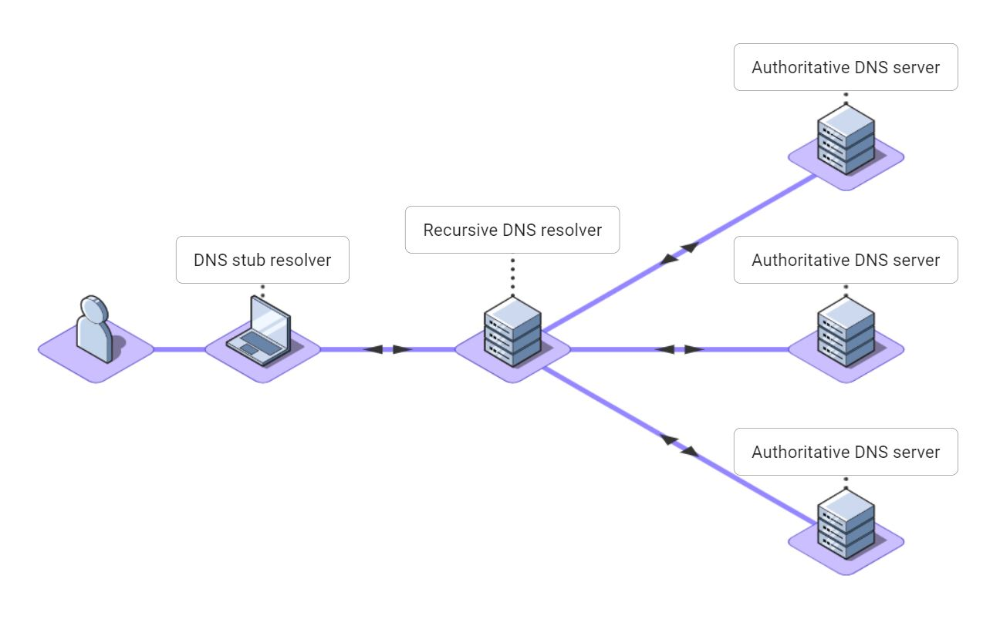
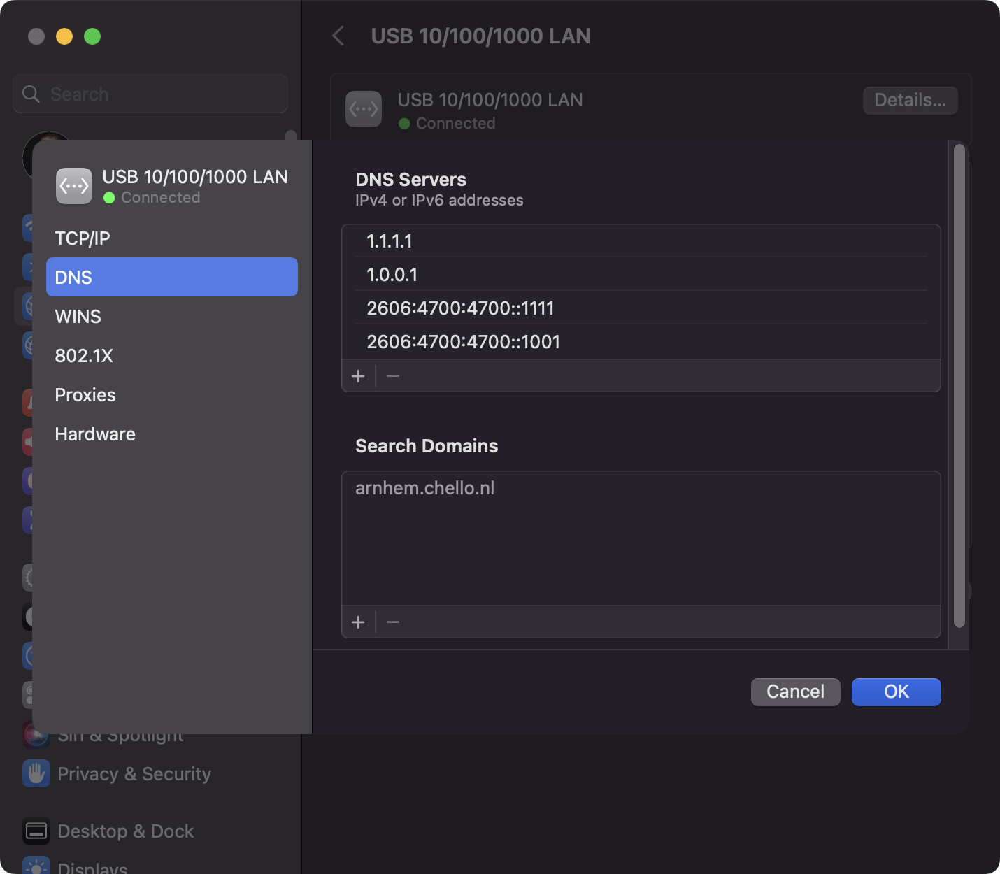
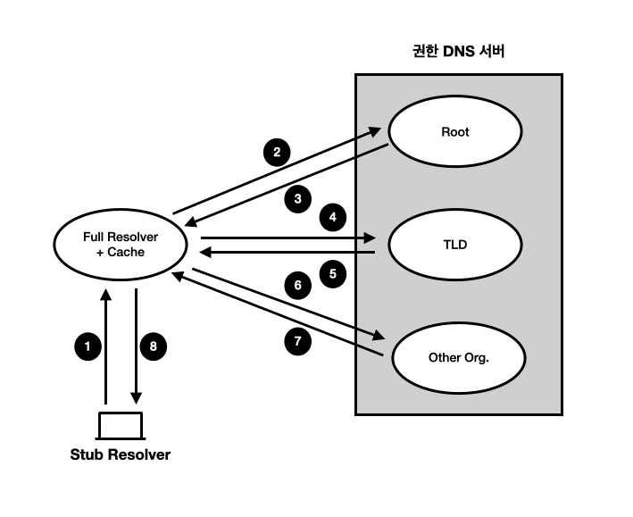

what is a dns stub resolver?
DNS 스텁 확인자는 컴퓨터, 휴대폰 또는 기타 인터넷 연결 장치에서 실행되는 응용 프로그램에 대해 DNS 이름 확인을 수행하는 운영 체제 구성 요소입니다.
스텁 리졸버라고 불리는 이유는 무엇입니까?
스텁 리졸버라는 용어가 이상하게 보일 수 있습니다. 스텁이라는 단어는 더 큰 것의 부분적이거나 하위 집합을 의미합니다.

스텁 확인자는 부분 DNS 확인자입니다. 재귀 DNS 확인자의 서비스에 의존합니다. 스텁 리졸버는 1989년 RFC 1123 섹션 6에서 처음 공식적으로 정의되었습니다.

스텁 확인자는 웹 브라우저와 같은 애플리케이션의 이름 확인 요청을 DNS 요청 메시지로 변환합니다. 스텁 확인자는 DNS 요청 메시지를 DNS 재귀 확인자에게 보내고 그 결과를 애플리케이션에 반환합니다.

스텁 리졸버는 자체적으로 재귀를 수행하지 않습니다. 대신, 자신을 대신하여 재귀를 수행하는 재귀 DNS 확인자와 대화합니다. 이를 통해 많은 스텁 확인자가 재귀 DNS 확인자의 캐시를 집합적으로 공유할 수 있습니다. 이렇게 하면 모든 스텁 확인자의 이름 확인 속도가 빨라지고 DNS의 전체 로드가 줄어듭니다.

스텁 확인자 또는 DNS 클라이언트?
스텁 확인자 및 DNS 클라이언트라는 용어는 동일한 의미, 즉 DNS 메시지를 재귀적 DNS 확인자에게 보내고 결과를 캐시하는 컴퓨터에서 실행되는 소프트웨어 구성 요소 또는 서비스를 의미하기 위해 같은 의미로 사용됩니다.

역사적으로 스텁 리졸버라는 용어가 사용되었습니다. DNS 스텁 확인자는 재귀적 DNS 확인자의 클라이언트로 간주될 수 있습니다. 그래서 나중에 DNS 클라이언트라는 용어가 만들어졌습니다.

Linux 기반 운영 체제는 일반적으로 스텁 확인자라는 용어를 사용하고 Windows 운영 체제는 DNS 클라이언트라는 용어를 사용합니다.

DNS 스텁 확인자는 어떻게 작동합니까?
DNS 스텁 확인자는 컴퓨터, 휴대폰 또는 기타 장치에서 실행되는 운영 체제의 일부입니다. 재귀 DNS 확인자와 통신하여 DNS 이름을 장치에서 실행되는 모든 애플리케이션의 IP 주소로 변환합니다.

일반적으로 DNS 스텁 확인자는 다음과 같이 사용됩니다.

사용자는 웹 브라우저와 같은 애플리케이션에 www.google.com과 같은 DNS 이름을 입력합니다.
애플리케이션은 표준 운영 체제 호출을 통해 이름에 대한 DNS 조회를 요청합니다.
장치의 DNS 스텁 확인자는 요청에 대한 DNS 메시지를 생성하고 이를 DNS 재귀 확인자로 보냅니다.
DNS 재귀 확인자는 캐시와 다양한 권한 있는 DNS 서버를 참조하여 이름에 대한 주소를 찾습니다. 자세한 내용은 재귀 DNS와 권한 있는 DNS에 대한 기사를 참조하세요.
이름의 IP 주소가 스텁 확인자로 다시 전송됩니다. 스텁 확인자는 IP 주소를 캐시하고 이를 애플리케이션에 반환합니다.
이제 웹 브라우저는 IP 주소에 연결할 수 있으며 웹페이지를 표시합니다.

어떤 DNS 재귀 확인자가 있습니까?
DNS 스텁 확인자는 어떤 DNS 재귀 확인자를 사용할지 어떻게 알 수 있나요?

컴퓨터나 다른 장치가 네트워크에 연결될 때마다 해당 DNS 스텁 확인자는 해당 네트워크에 대해 재귀 DNS 확인자를 사용하도록 자동으로 구성됩니다. 일반적으로 이 재귀 DNS 확인자는 ISP 또는 셀룰러 데이터 통신업체에 속합니다.

개인 정보 보호, 속도 또는 안정성을 위해 다른 DNS 재귀 확인자를 사용할 수 있습니다. 또는 부적절한 웹 사이트 필터링과 같은 기능을 제공하는 것입니다.

모든 운영 체제에서는 사용자가 원하는 DNS 재귀 확인자를 지정할 수 있습니다. 널리 사용되는 재귀 DNS 확인자는 다음과 같습니다.

Cloudflare - 1.1.1.1: 사용 가능한 가장 빠른 개방형 DNS 확인자 중 하나입니다.
Google - 8.8.8.8: 하루에 1조 개가 넘는 쿼리를 처리하는 최대 규모의 개방형 DNS 확인자입니다.
OpenDNS - 208.67.222.222: 개방형 DNS 확인자일 뿐만 아니라 "Umbrella"라는 보안 제품군을 제공합니다.
Quad9 - 9.9.9.9: 개인 정보 보호 및 사이버 보안 개선을 목표로 하는 스위스 비영리 단체입니다.

Mac OS의 DNS 스텁 확인자
Mac OS에서 DNS 스텁 확인자 설정으로 이동하려면 다음을 수행하세요.

Apple 메뉴에서 시스템 설정을 엽니다.
사이드바에서 네트워크를 클릭하세요.
네트워크 연결을 클릭하세요
세부정보를 클릭하세요.
DNS를 클릭하세요

DNS 스텁 확인자를 어떻게 우회합니까?

호스트 파일은 DNS 항목이 포함된 특수 텍스트 파일입니다. DNS 스텁 확인자는 애플리케이션 이름 확인 요청에 응답하기 위해 DNS 재귀 확인자에 쿼리를 보내는 대신 호스트 파일의 이름과 주소를 사용합니다.
아마도 노트북에서 웹 사이트를 테스트하고 있으며 호스트 이름 mytestwebsite.example.org가 IP 주소 10.10.10.10으로 확인되기를 원할 것입니다. 노트북의 호스트 파일에 다음 텍스트 줄을 추가합니다.
10.10.10.10 mytestwebsite.example.org
거의 모든 운영 체제는 호스트 파일을 지원하고 동일한 파일 형식을 사용하지만 호스트 파일은 다른 위치에 있습니다.

Windows: %SystemRoot%\System32\drivers\etc\hosts
Mac OS: /etc/hosts(/private/etc/hosts에 대한 심볼릭 링크)
대부분의 Linux 버전: /etc/hosts
안드로이드: /etc/hosts
호스트 파일을 사용하면 이름에 잘못된 주소를 삽입하여 이름 확인을 차단할 수 있습니다. 이는 특정 DNS 이름이 확인되는 것을 방지하려는 경우에 유용합니다. 일부 광고 차단 소프트웨어 패키지는 이를 사용하여 광고가 표시되는 것을 방지합니다.

손상된 DNS 확인자 수정
DNS는 매우 중요하므로 스텁 확인자가 제대로 작동하지 않는 경우 뼈아프게 알게 될 것입니다!

스텁 리졸버의 결과를 다른 리졸버와 비교하려면 ping, nslookup 또는 dig와 같은 명령줄 도구를 실행하고 A 레코드 조회에서 얻은 결과를 비교할 수 있습니다.

ping 명령줄 도구는 웹 브라우저나 다른 애플리케이션과 동일한 방식으로 DNS 스텁 확인자를 호출하기 때문에 편리합니다. DNS 재귀 확인자 주소를 8.8.8.8 대신 8.8.8.9로 지정하여 DNS 스텁 확인자를 실수로 잘못 구성한 경우 어떤 웹 사이트에도 연결할 수 없다는 것을 알게 될 것입니다. Windows에서는 다음과 같은 출력이 표시됩니다.

DNS 스텁 확인자에 문제가 있는 경우 취할 수 있는 몇 가지 단계는 다음과 같습니다.

호스트 파일을 열고 일반적인 이름 확인을 방해할 수 있는 예기치 않은 줄이 있는지 확인하세요.
DNS 스텁 확인자 구성을 확인하고 예상치 못한 기본 또는 대체 DNS 서버가 설정되어 있는지 확인하세요.
DNS 스텁 확인자를 "자동으로 DNS 서버 주소 받기"로 변경해 보세요.
DNS 서버 주소를 8.8.8.8 및 8.8.4.4로 설정하여 Google DNS를 사용하도록 DNS 스텁 확인자를 변경해 보세요.
DNS 서버 주소를 1.1.1.1 및 1.0.0.1로 설정하여 Cloudflare를 사용하도록 DNS 스텁 확인자를 변경해 보세요.

---

DNS(Domain Name System)에서 `DNS stub resolver`와 `DNS server`는 서로 다른 역할을 하는 두 가지 컴포넌트입니다. 각각의 기능과 역할에 대해 자세히 설명드리겠습니다.

### DNS Stub Resolver

`DNS stub resolver`는 클라이언트 측에서 DNS 쿼리를 처리하는 작은 DNS 해석기입니다. 사용자가 도메인 이름(예: www.example.com)을 입력할 때 이 도메인 이름을 IP 주소로 변환하기 위해 동작합니다. 주요 특징과 역할은 다음과 같습니다:

1. **클라이언트 측에 존재**: 일반적으로 운영 체제나 애플리케이션 내에 내장되어 있습니다.
2. **기본 기능 제공**: 도메인 이름을 IP 주소로 변환하기 위한 기본적인 DNS 요청을 생성하고 처리합니다.
3. **DNS 서버와 통신**: 직접 DNS 서버(보통 로컬 네트워크 내의 캐싱 DNS 리졸버)와 통신하여 DNS 쿼리를 전달하고 응답을 받습니다.
4. **단순 쿼리 처리**: 복잡한 재귀적 조회를 수행하지 않고, 보통 단순히 캐싱 DNS 리졸버로 쿼리를 전달하고 응답을 받는 역할만 합니다.

### DNS Server

`DNS server`는 도메인 이름과 IP 주소 간의 매핑 정보를 저장하고 제공하는 서버입니다. 여러 종류의 DNS 서버가 있으며, 그 역할은 다음과 같습니다:

1. **캐싱 DNS 리졸버(Caching DNS Resolver)**:

   - **중재 역할**: 클라이언트의 DNS 요청을 받아 다른 DNS 서버에 재귀적으로 쿼리를 전달하여 응답을 반환합니다.
   - **캐싱**: 자주 요청되는 도메인 이름에 대한 응답을 캐싱하여 성능을 향상시킵니다.
   - **예**: ISP의 DNS 서버, 공용 DNS 서버(예: Google DNS, Cloudflare DNS) 등.

2. **권한 DNS 서버(Authoritative DNS Server)**:
   - **권한 있는 응답 제공**: 자신이 관리하는 도메인 이름에 대한 최종 응답을 제공합니다.
   - **DNS 레코드 저장**: 도메인 이름과 관련된 DNS 레코드(A, AAAA, MX, NS 등)를 저장하고 관리합니다.
   - **예**: example.com 도메인을 관리하는 DNS 서버.

### 요약

- **DNS Stub Resolver**: 클라이언트 측에서 DNS 쿼리를 생성하고, DNS 서버에 전달하여 응답을 받는 단순한 역할을 수행합니다.
- **DNS Server**: DNS 요청을 처리하고, 도메인 이름과 IP 주소 간의 매핑 정보를 제공하는 서버입니다. 캐싱 DNS 리졸버와 권한 DNS 서버로 나뉩니다.

이 두 가지 컴포넌트는 함께 동작하여 인터넷 사용자가 도메인 이름을 통해 웹사이트에 접근할 수 있도록 돕습니다. 클라이언트는 DNS stub resolver를 통해 요청을 보내고, 여러 DNS 서버를 거쳐 최종 IP 주소를 얻어 웹사이트에 접속하게 됩니다.

---

dns에서 위임하는쪽을부모라하고 위임받는쪽을자식이라고한다.dns기능은크게정보를제공하는기능과이름을변환하는기능으로나눌수있다.이름에관한 정보를 제공하는 기능은 권한 Dns서버가 제공하고이름을 변환하는 기능은리졸버(resolver)가 제공한다.리졸버는클라이언트애 플리케이션의 이름변환 라이브러리에 해당하는 스텁 리졸버와 이름 변환 서비스를 제공하는 풀 리졸버로 나뉜다.스텁리졸버와풀리졸버로 나뉜다. 스텁 리졸버와 풀 리졸버의 사이에는 질의와 응답을 중계하는 포워더(dns프록시)가 들어갈수있다.

1. 애플리케이션에서 이름 변환을 요청받은 스텁 리졸버는 풀 리졸버에게 DNS 질의를 보냄
2. 풀 리졸버는 루트 DNS 서버의 정보가 사전에 설정되어 있으므로 스텁 리졸버에게 받은 질의와 동일한 내용을 루트 DNS 서버에 질의한다.
3. 루트 DNS 서버는 TLD의 위임 정보만 알고 있으므로 위임 정보를 반환한다.
4. 풀 리졸버는 루트 DNS 서버에서 얻은 위임 정보에 따라 스텁 리졸버에게 받은 질의와 동일한 내용을 TLS DNS 서버로 질의한다.
5. TLD DNS 서버는 조직 도메인명의 위임 정보만 알고 있으므로 위임 정보를 반환한다.
6. 풀 리졸버는 TLD DNS 서버로부터 얻은 위임 정보에 따라 스텁 리졸버에게 받은 질의와 동일한 내용을 조직의 DNS 서버로 질의한다.
7. 풀 리졸버는 이름 변환이 완료되었음을 판정하고 스텁 리졸버로 결과를 반환한다.

위 순서를 거쳐서 애플리케이션은 IP 주소와 같은 정보를 얻을 수 있다.

풀 리졸버에서 이름을 변환하는 것은 비용도 많이 들고 시간도 오래 걸리는 작업이다. 따라서 검색 도중의 정보와 검색결과를 캐시(cashe)에 보관했다 이후에 사용하여 클라이언트가 질의한 내용에 응답하는 시간을 줄임과 동시에 권한 dns 서버로의 질의 수를 줄인다. 이캐시 기능에 주목해서 풀 리졸버를 '캐시 Dns 서버' 라고도 부른다. 하지만 Dns 사용을 정의하는 Rfc 1034/1035에는 이러한 내용이없다.

캐시라는 양날의 검
full resolver cache는 이름을 변환할때 부하나 시간을 단축하는 이점은 있지만, 도메인명과 주소값을 빠르게 대응하여 변경할 수 없다는 약점이 있다. 이 문제를 해결하기 위해 Db의 엔트리에 캐시 가능한 시간(time to live, ttl)을 설정하고, 단시간에 변경하는 경우엥는 짧은 Ttl을 지정한다. 또한 캐시에 악의적인 정보를 주입하면 캐시가 유지되는 동안 풀 리졸버는 해당 정보에 기반해서 응답하게 되므로 문제가 생긴다. 이런 공격 수법을 '캐시오염 공격(cache poisoning attack)' 이라 한다.
DNS에 등록된 정보
타입에는 IPv4 주소를 저장하는 A나 IPv6 주소를 저장하는 AAAA, 메일 서버 정보를 저장하는 MX, 위임 정보를 나타내는 NS, 존 관리 정보를 저장하는 SOA, 별칭 변환의 정식 이름을 저장하는 CNAME 등이 있다. 각 타입의 리소스 레코드를 A 리소스 레코드, AAAA 리소스 레코드라 한다.

또한 도메인명 마지막에 점(.)이 있으면 절대 도메인명이라고 하며 완전한 도메인명을 나타낸다. 반대로 마지막에 점을 생략한 것은 상대 도메인명이라고 하며 문맥에 따라 도메인명이 채워진다.

---

> https://www.nslookup.io/learning/what-is-a-dns-resolver/
> 출처 : 인프라 엔지니어의 교과서 시스템 구축과 관리편 5장 DNS
