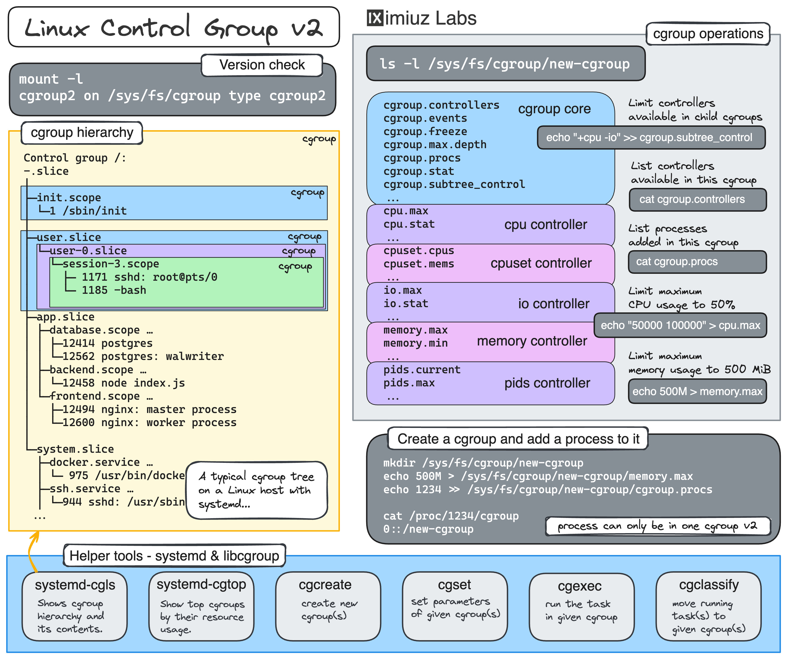

한 조직에서 다양한 프로세스를 조율하기 위해 마이크로서비스 아키텍처를 사용하는 온라인 저축 계좌 애플리케이션을 구현했습니다. 오케스트레이션 프로세스 중 하나는 저축 계좌 생성을 위한 다양한 API 호출을 오케스트레이션하는 "계정 생성"입니다. 성능상의 이유로 API 오케스트레이션은 동기 및 비동기 호출이 혼합되어 있습니다. 특정 비동기 호출이 실패할 때 시스템을 일관성 없는 상태로 남겨두는 것이 관찰되었습니다. 예를 들어 예금 계좌는 생성되었지만 고객 정보는 생성되지 않았을 수 있습니다. 아키텍트로서 시스템의 최고의 내구성을 보장하기 위해 무엇을 하시겠습니까?

saa
귀하는 중요한 애플리케이션을 aws에 배포할 책임이 있습니다. 악의적인 활동을 식별하기 위해 웹 애플리케이션로그를 모니터링 해야 합니다

cloudwatch

vpc의 프라이빗 서브넷에서 호스팅되는 인스턴스가 있습니다. 인터넷에서 업데이트를 다운로드하려면 인스턴스가 필요합니다. 설계자로서 가장 효율적이고 안전한 it운영 팀에 어떤 변화를 제안하시겠습니까?

A. 새 퍼블릭 서브넷을 만들고 인스턴스를 해당 서브넷으로 이동합니다
B. 새 ec2 인스턴스를 생성하여 업데이트를 별도로 다운로드한 다음 필요한 인스턴스로 푸시합니다.
C. NAT 게이트웨이를 사용하여 프라이빗 서브넷의 인스턴스가 업데이트를 다운로드하도록 허용합니다.
D. 프라이빗 서브넷의 인스턴스가 업데이트를 다운로드 할 수 있도록 인터넷에 대한 vpc 링크를 생성합니다.

당신은 모바일 앱과 웹사이트를 통해 판매할 스톡 이미지와 비디오를 제작하는 미디어 회사에서 일하는 솔루션 설계자입니다. 앱과 웹사이트에서 사용자는 자신이 구매한 스톡 콘텐츠에만 액세스 할 수 있습니다. 콘텐츠는 s3 버킷에 저장됩니다. 사용자가 구매한 여러 파일에 대한 액세스를 제한해야 합니다 또한 스톡 콘텐츠(여러사용자가 구매가능)의 특성으로 인해 각 스톡 항목의 url을 변경하고 싶지 않습니다 귀하의 시나리오에 가장 적합한 액세스 제어 옵션은 무엇입니까?

SAA associated
it 회사는 최근 웹서버가 sqs대기열의 메시지를 통해 애플리케이션 서버와 통신할 수 있도록

SAA
웹사이트는 elastic load balancer 뒤에 있는 두개의 ec2 인스턴스에서 호스팅 됩니다 웹사이트의 응답 시간이 크게 느려지고 대기 시간으로 인해 고객의 주문이 줄어 듭니다 문제 해결을 통해 ec2 인스턴스 중 하나에 장애가 발생했으며 현재 하나의 인스턴스만 실행되고 있는 것으로 나타났습니다

애플리케이션은 다음 vpc 아키텍처로 구성됩니다
elb뒤의 여러 az에 있는 ec2 인스턴스
ec2 인스턴스는 auto scaling 그룹을 통해 시작됩니다
인터넷에서 업데이트를 다운로드 하기 위해 모든 az의 인스턴스에 대해 하나의 nat 게이트웨이가 있습니다.
가용성에 기반한 아키텍처의 병목 현상은 무엇입니까?

대기열 및 메시징 개념

saa
미디어 회사는 aws에서 관계형 데이터 베이스를 호스팅할 계획입닏다 그들은 수동 개입 없이 가변적이고 예측할수없는 워크로드를 처리할수 있고 애플리케이션의 사용자 트래픽에 따라 컴퓨팅 용량을 확장 및 축소할수있는 rds 제품군의 데이터 베이스를 원합니다
a. amazon aurora
b. amazon
c. amazon aurora serverless

saa
1gb-3gb 범위의 대용량 파일을 aws s3 버킷에 업로드하고있습니다 사용자가 다운로드 중에 잠재적 손상을 식별하기 위해 체크섬의 유효성을 검사할 수 있도록 조직에는 전체 파일을 읽어 파일의 해시 체크섬을 계산해야 하는 요구사항이 있습니다 이를 위해 lambda함수를 생성하고 s3알림을 통해 트리거되도록 했습니다 그러나 요청 시가니

SAA
1GB – 3GB 범위의 대용량 파일을 AWS S3 버킷에 업로드하고 있습니다. 사용자가 다운로드 중에 잠재적 손상을 식별하기 위해 체크섬의 유효성을 검사할 수 있도록 조직에는 전체 파일을 읽어 파일의 해시 체크섬을 계산해야 하는 요구 사항이 있습니다. 이를 위해 Lambda 함수를 생성하고 S3 알림을 통해 트리거되도록 했습니다. 그러나 요청 시간이 초과되었습니다. 그 이유는 무엇입니까?
A. Lambda 함수는 128MB의 최소 메모리로 구성됩니다.

B. Lambda 함수는 NAT 게이트웨이 또는 VPC 엔드포인트 없이 프라이빗 VPC에서 실행되도록 설정됩니다.

C. 환경 변수에 S3 버킷 이름을 설정하지 않았습니다.

D. Lambda 함수는 S3 버킷과 다른 리전에서 생성됩니다.

Cassandra를 실행하려면 여러 EC2 인스턴스를 시작해야 합니다. Cassandra에는 대규모 분산 및 복제 워크로드가 있으며 EC2 배치 그룹을 사용하여 인스턴스를 시작할 계획입니다. 트래픽은 여러 파티션에 고르게 분산되어야 하며 각 파티션에는 여러 인스턴스가 포함되어야 합니다. 요구 사항을 달성하기 위해 다음 배치 그룹 중 어느 것을 사용하시겠습니까?
A. 클러스터 배치 그룹

B. 스프레드 배치 그룹

C. 파티션 배치 그룹

D. 네트워크 배치 그룹

aws 컴퓨팅 서비스와 적합한 용례

ENA
EFA
ENI
EN
의 차이를 공부

스토리지 서비스와 적합한 용례

EFS
