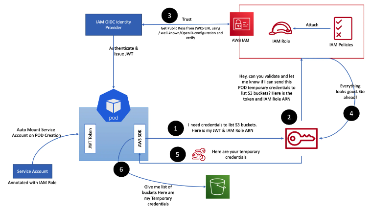

aws에는 iam(identity and access management) 라는 rabac 기반 접근관리 서비스가 있습니다.
이 iam의 role을 통해서 리소스와 리소스간 접근 관리도 할 수 있고, user에게 적절한 접근 정책을ㅇ 줘서 유저의 접근 관리도 할 수 있습니다

일반적으로 ec2에 iam role을 할당하여 ec2위에서 동작하는 application이 aws sdk를 사용하거나 aws cli를 사용할때 ec2에 부여된 iam role의 권한으로 s3나 secretmanager와 같은 리소스에 접근할 수 있도록 사용 할 수 있다.

그러면 eks cluster안에서 동작하는 kubernetes pod에는 어떻게 iam role을 줄 수 있을까? eks cluster 내부에서 pod에게 iam role권한을 주는 방식 irsa입니다.

eks cluster 내부 pod에 리소스 접근 권한을 주는 방법은?

1. eks cluster node인 ec2에 iam role을 할당하여 pod가 node의 iam role을 자동으로 가져갈 수 있게 할수있습니다. 단, ec2내부에 imdsv1방식을 사용할 수 있도록 허용이 되어야 한다.
2. iam user의 accesskey를 pod에서 사용하는 aws sdk나 aws cli에 설정하는 방법입니다.
   이방법은 보안상 매우 취약하며 보안 정책상 accesskey를 주기적으로 변경해야 할 수 있기 때문에 관리도 매우 어렵다
3. irsa

irsa란?
irsa는 iam role for service account의 약자 입니다. kubernetes의 servicaccount를 사용하여 pod의 권한을 iamrole로 제어할 수 있도록 하는 기능을 말합니다.
serviceaccount는 aws의 자원이 아닌데 어떻게 iam role을 할당할 수 있는 걸까요? 이걸 해주는게 바로 oidc라고 불는 openid connect입니다.

servicaccount란?
우선 더 살펴보기전에 위에서 말씀드린 servicaccount에 대해서 알아보도록 하겠습니다. 서비스 어카운트는 kubernetes의 파드에서 api 서버에 요청을 보냈을 때 이 파드를 식별하기 위한 리소스 이다.

파드에서 api서버에 요청을 보내면 이 파드의 정체가 무엇인지 알아야 어떤 권한을 가지고 있는지도 알 수 있고, 이를 기반으로 파드으이 요청이 권한에 맞는지를 확인하여 요청을 처리해줄지 말지를 결정할 수 있게 되는데요. 실제롤 권한을 정의하고, 설정하는 부분으 Role, clusterrole, rolbinding, clusterrolebinding,의 역할이고, servicaccount는 이러한 권한을 적용할 수 있는 주체 중 한가지로서, Pod에게는 신분증과 같은 인증서 역할을 하게 됩니다.

ocid란?
위에서 설명 드린 oidc는 무엇일까요? openid connect는 google등의 idp(id공급자)에 로그인 할 수 있도록 지원하는 표준 인증 프로토콜 입니다. 권한 허가 프로토콜인 Oauth2.0기술으 이용하여 만들어진 읹으 레이어로 Json 포맷을 이용하여 Restful api형식을 사용하여 인증을 하게 됩니다. oidc를 사용하면 손쉽게 외부 서비스를 통해 사용자 인증을 구현할 수 있게 됩니다.

즉, Kubernetes의 리소스와 aws리소스 처럼 서로다른 리소스간의 인증을 oidc를 사용하여 할 수 있다.

위 그림은 aws공식 블로그에서 가져왔으며 pod위에서 동작하는 application이 aws s3 bucket의 List를 가져올떄의 동작 흐름 예시 입니다. 간단히 설명드리면

pod위에서 동작하느 application이 aws sdk를 사용하여 s3의 리스트를 가져오려고 합니다. 이때 jwt와 Iam role의 arn 정보를 aws sts에게 전달합니다.
sts는 aws iam에게 임시 자격증명을 줄 수 있는지 확인을 요청합니다
iam은 iam oidc provider와 통신하고, pod에 할당된 Serviceaccount에 iam role 정보가 잘 annotate 되어 있는 지 확인한 후에 iam에게 확인 되었다는 응답을 주게 됩니다.
iam은 sts에게 권한을 줘도 된다고 응답을 주게 되고 aws sts는 pod의 aws sdk에게 임시 자격증명을 전달합니다.
최종적으로 pod의 aws sdk는 aws s3의 리스트를 가져 올 수 있게 됩니다.

참고: jwt란? json web token의 약자로 일반적으로 http api 서버를 만들때에 인증 방법으로 사용 서버는 사용자가 로그인할때 고유한 token을 생성하고 이를 사용자에게 알려주어 사용자가 다른 api를 사용 할때에 헤더에 이 token을 넣으면 자신이라는 것을 증명할 수 있게 하는것

참고: aws sts란? aws 리소스에 접근할수 있는 권한에 대해 임시자격 증명을 가져오도록 하는 서비스 입니다.

IRSA를 사용하는 이유
EKS 에서 IRSA를 사용하는 이유는 보안 취약성을 줄이기 위해서 입니다. pod에 IAM Role을 할당하는 방법중에 위에서 설명드린 1번 Node에 IAM Role을 할당하면 IRSA를 사용하지 않아도 쉽게 권한 제어를 할 수 있습니다. 하지만 Node안에는 다양한 서비스의 pod들이 떠있을 가능성이 있습니다.

물론 서비스별로 Node affinify 나 selector를 사용해서 구분해놓았을 수도 있습니다만 그럴 경우 유휴자원이 생길 가능성이 높아집니다. 어쨋든 1번 방법은 노드에 IAM Role을 할당하기 때문에 pod별로 IAM Role관리를 할 수 없게 된다는 말이되는데요. 이렇게 되면 보안에 취약점이 생기게 되는 것이죠. 일반적으로 kubernetes자원은 각 어플리케이션 명칭 별로 namesapce 별로 구분하여 관리를 하게 되는데 여기서 IRSA를 사용하게 되면 namespace별로 각각 다른 serviceaccount를 만들고 해당 pod에 각각 다른 IAM Role을 부여할 수 있게 되는 것이죠.

---

aws loadbalancer controller 설치

- terraform module
- kubectl
- helm

필요한 자원
oidc
cert-manager 설치 -K8s 오브젝트
controller가 사용할 IAM ,sa,controller yaml
